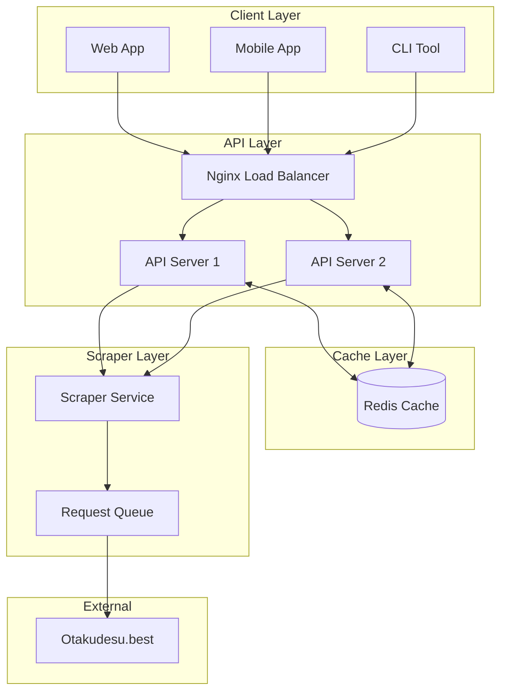
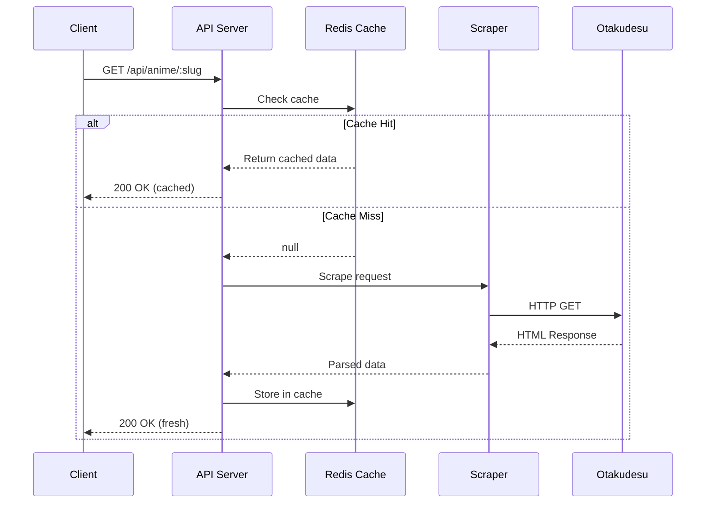
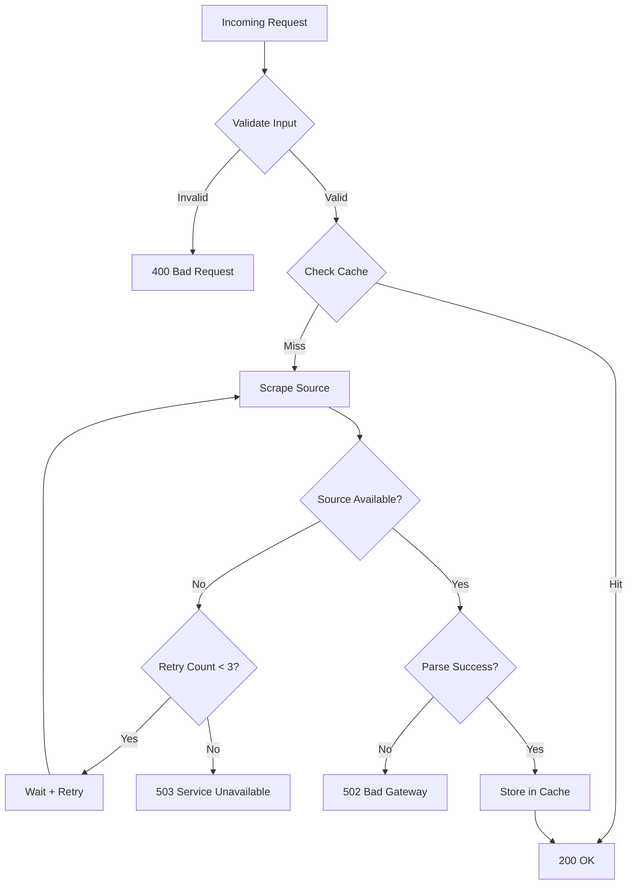
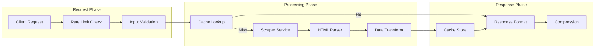
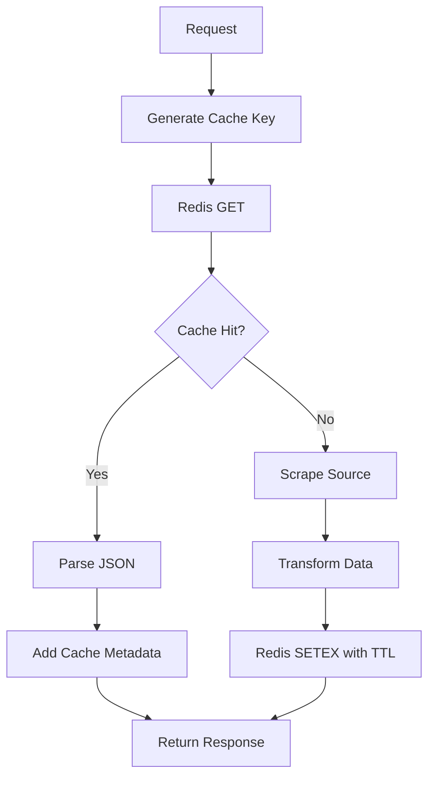
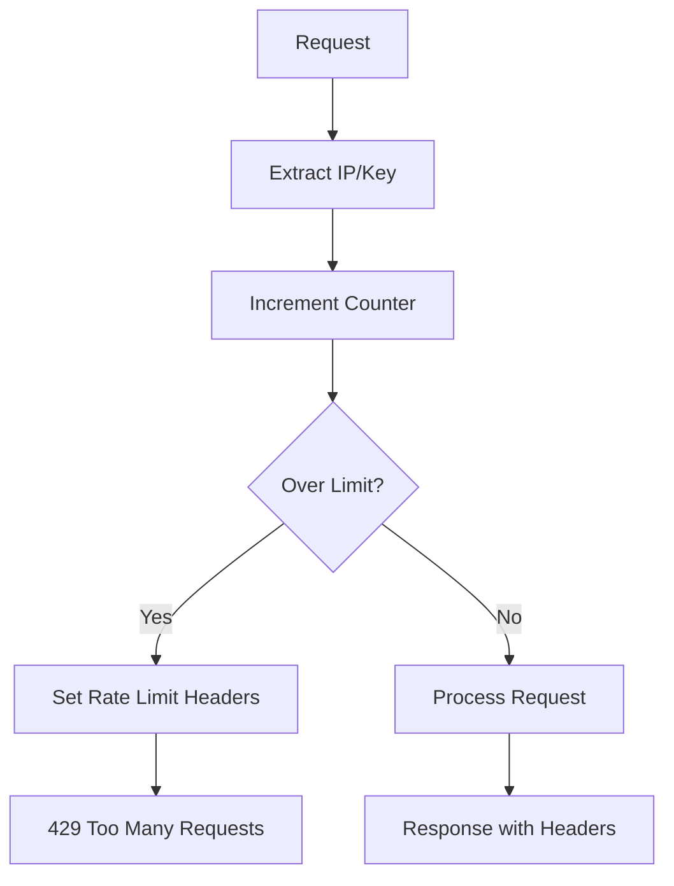
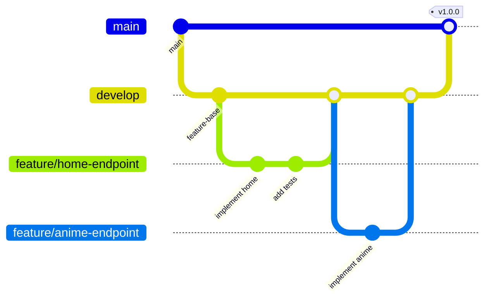
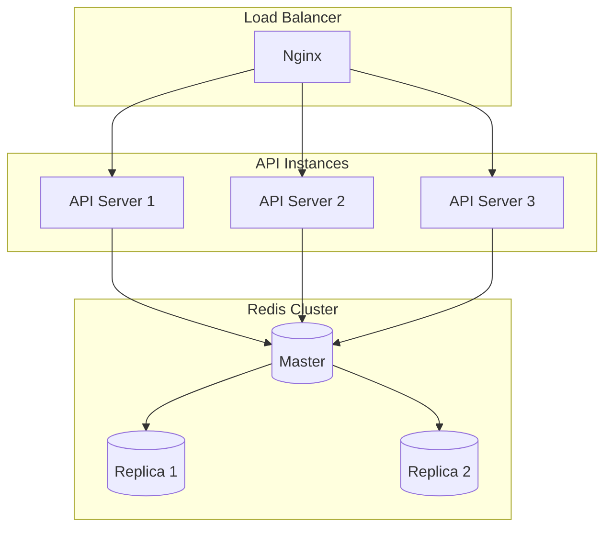
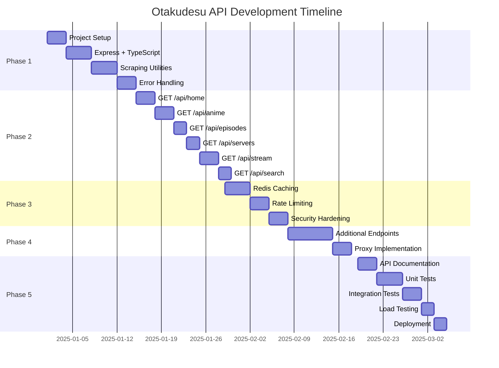
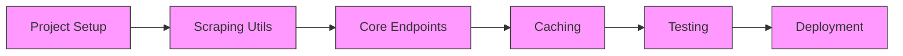

# Technical Plan Document
## Otakudesu API Scraper

---

## 1. System Architecture

### 1.1 Architecture Diagram



### 1.2 Request/Response Flow



### 1.3 Error Handling Flow



---

## 2. Technology Stack Detail

### 2.1 Runtime Environment

| Component | Version | Purpose |
|-----------|---------|---------|
| Node.js | 20.x LTS | Runtime |
| TypeScript | 5.3.x | Type safety |
| npm | 10.x | Package manager |

### 2.2 Core Dependencies

```json
{
  "dependencies": {
    "express": "^4.18.2",
    "axios": "^1.6.5",
    "cheerio": "^1.0.0-rc.12",
    "redis": "^4.6.12",
    "zod": "^3.22.4",
    "helmet": "^7.1.0",
    "cors": "^2.8.5",
    "express-rate-limit": "^7.1.5",
    "winston": "^3.11.0",
    "dotenv": "^16.3.1",
    "compression": "^1.7.4",
    "http-proxy-middleware": "^2.0.6"
  },
  "devDependencies": {
    "typescript": "^5.3.3",
    "@types/express": "^4.17.21",
    "@types/node": "^20.10.6",
    "@types/compression": "^1.7.5",
    "@types/cors": "^2.8.17",
    "tsx": "^4.7.0",
    "nodemon": "^3.0.2",
    "eslint": "^8.56.0",
    "@typescript-eslint/eslint-plugin": "^6.18.0",
    "@typescript-eslint/parser": "^6.18.0",
    "prettier": "^3.1.1",
    "jest": "^29.7.0",
    "@types/jest": "^29.5.11",
    "ts-jest": "^29.1.1",
    "supertest": "^6.3.3",
    "@types/supertest": "^6.0.2"
  }
}
```

### 2.3 TypeScript Configuration

```json
{
  "compilerOptions": {
    "target": "ES2022",
    "module": "NodeNext",
    "moduleResolution": "NodeNext",
    "outDir": "./dist",
    "rootDir": "./src",
    "strict": true,
    "esModuleInterop": true,
    "skipLibCheck": true,
    "forceConsistentCasingInFileNames": true,
    "resolveJsonModule": true,
    "declaration": true,
    "declarationMap": true,
    "sourceMap": true
  },
  "include": ["src/**/*"],
  "exclude": ["node_modules", "dist", "tests"]
}
```

---

## 3. Data Flow Diagram

### 3.1 Complete Request Lifecycle



### 3.2 Caching Mechanism



### 3.3 Rate Limiting Flow



---

## 4. Detailed API Endpoints Specification

### 4.1 GET /api/home

**Purpose:** Fetch homepage data including spotlight, top airing, and latest episodes.

**Cache Key:** `otaku:home`
**TTL:** 300 seconds (5 minutes)

**Scraping Strategy:**
```typescript
// CSS Selectors
const selectors = {
  spotlight: '.spotlight-item',
  spotlightTitle: '.spotlight-title',
  spotlightThumb: '.spotlight-thumb img',
  topAiring: '.top-airing .anime-item',
  latestEpisodes: '.latest-episode .episode-card'
};
```

**Data Transformation:**
```typescript
interface HomeData {
  spotlight: Array<{
    slug: string;      // Extract from href
    title: string;     // .spotlight-title text
    thumbnail: string; // img src
    episode: string;   // .episode-badge text
    rating: number;    // Parse from .rating text
    type: AnimeType;   // .type-badge text
  }>;
  topAiring: Array<SpotlightItem>;
  latestEpisodes: Array<EpisodeItem>;
}
```

---

### 4.2 GET /api/anime/:slug

**Purpose:** Get complete anime details.

**Cache Key:** `otaku:anime:{slug}`
**TTL:** 3600 seconds (1 hour)

**Scraping Strategy:**
```typescript
const selectors = {
  title: '.anime-title h1',
  altTitles: '.alt-titles span',
  thumbnail: '.anime-thumb img',
  synopsis: '.synopsis p',
  info: '.anime-info li',
  genres: '.genres a',
  episodes: '.episode-list li',
  recommendations: '.recommendations .anime-card'
};
```

---

### 4.3 GET /api/episodes/:slug

**Cache Key:** `otaku:episodes:{slug}`
**TTL:** 1800 seconds (30 minutes)

**Scraping Strategy:**
```typescript
const selectors = {
  episodeList: '.episode-list .episode-item',
  episodeNumber: '.episode-num',
  episodeTitle: '.episode-title',
  releaseDate: '.release-date',
  thumbnail: '.episode-thumb img'
};
```

---

### 4.4 GET /api/servers

**Cache Key:** `otaku:servers:{epId}`
**TTL:** 900 seconds (15 minutes)

**Scraping Strategy:**
```typescript
const selectors = {
  serverList: '.server-list .server-item',
  serverName: '.server-name',
  serverQuality: '.quality-badge',
  serverType: '[data-type]'
};
```

---

### 4.5 GET /api/stream

**Cache Key:** `otaku:stream:{epId}:{server}`
**TTL:** 300 seconds (5 minutes)

**Scraping Strategy:**
```typescript
// May require iframe extraction
const selectors = {
  iframe: '.player-container iframe',
  sources: 'script:contains("sources")'
};

// Parse embedded JSON for stream URL
const extractStreamUrl = (html: string): string => {
  const match = html.match(/sources:\s*\[(.*?)\]/s);
  return match ? JSON.parse(`[${match[1]}]`)[0].file : '';
};
```

---

### 4.6 GET /api/search

**Cache Key:** `otaku:search:{query}:{limit}`
**TTL:** 600 seconds (10 minutes)

**Scraping Strategy:**
```typescript
const selectors = {
  results: '.search-results .anime-card',
  title: '.anime-title',
  thumbnail: '.anime-thumb img',
  type: '.type-badge',
  status: '.status-badge',
  rating: '.rating',
  genres: '.genres span'
};
```

---

### 4.7 GET /api/genres

**Cache Key:** `otaku:genres`
**TTL:** 86400 seconds (24 hours)

**Scraping Strategy:**
```typescript
const selectors = {
  genreList: '.genre-list a',
  genreName: 'text()',
  genreSlug: '[href]',
  genreCount: '.count'
};
```

---

### 4.8 GET /api/schedule

**Cache Key:** `otaku:schedule` or `otaku:schedule:{day}`
**TTL:** 3600 seconds (1 hour)

**Scraping Strategy:**
```typescript
const selectors = {
  daySection: '.schedule-day',
  dayName: '.day-header',
  animeList: '.schedule-anime',
  animeTitle: '.anime-title',
  releaseTime: '.release-time'
};
```

---

### 4.9 GET /api/anime (Browse)

**Cache Key:** `otaku:browse:{genre}:{year}:{type}:{status}:{page}:{sort}`
**TTL:** 1800 seconds (30 minutes)

---

### 4.10 GET /api/batch/:slug

**Cache Key:** `otaku:batch:{slug}`
**TTL:** 3600 seconds (1 hour)

**Scraping Strategy:**
```typescript
const selectors = {
  batchSection: '.batch-download',
  qualitySection: '.quality-row',
  quality: '.quality-label',
  size: '.file-size',
  links: '.download-links a'
};
```

---

### 4.11 GET /api/proxy

**No caching** - Direct proxy pass-through

**Security:**
```typescript
const allowedDomains = [
  'otakudesu.best',
  'stream.otakudesu.best',
  'cdn.otakudesu.best'
];
```

---

### 4.12 GET /api/search/suggest

**Cache Key:** `otaku:suggest:{query}`
**TTL:** 1800 seconds (30 minutes)

---

## 5. Caching Strategy Detail

### 5.1 Redis Key Structure

```
otaku:{resource}:{identifier}:{params}

Examples:
- otaku:home
- otaku:anime:spy-x-family-sub-indo
- otaku:episodes:spy-x-family-sub-indo
- otaku:servers:spy-x-family-ep-1
- otaku:stream:spy-x-family-ep-1:hd-1
- otaku:search:one+piece:20
- otaku:genres
- otaku:schedule:monday
- otaku:browse:action:2024:tv:ongoing:1:rating
- otaku:batch:spy-x-family-sub-indo
- otaku:suggest:spy
```

### 5.2 TTL Configuration

| Resource | TTL (seconds) | Rationale |
|----------|---------------|-----------|
| home | 300 | Frequent updates |
| anime | 3600 | Stable data |
| episodes | 1800 | New eps added |
| servers | 900 | Server availability |
| stream | 300 | Links expire |
| search | 600 | Query results |
| genres | 86400 | Rarely changes |
| schedule | 3600 | Daily updates |
| browse | 1800 | Filter results |
| batch | 3600 | Stable links |
| suggest | 1800 | Search hints |

### 5.3 Cache Service Implementation

```typescript
// src/services/cache.service.ts
import { createClient, RedisClientType } from 'redis';

export class CacheService {
  private client: RedisClientType;
  
  async get<T>(key: string): Promise<T | null> {
    const data = await this.client.get(key);
    return data ? JSON.parse(data) : null;
  }
  
  async set(key: string, value: unknown, ttl: number): Promise<void> {
    await this.client.setEx(key, ttl, JSON.stringify(value));
  }
  
  async invalidate(pattern: string): Promise<void> {
    const keys = await this.client.keys(pattern);
    if (keys.length) await this.client.del(keys);
  }
}
```

### 5.4 Memory Management

```typescript
// Redis configuration
const redisConfig = {
  maxmemory: '256mb',
  maxmemoryPolicy: 'allkeys-lru', // Evict least recently used
  maxmemory_samples: 5
};
```

---

## 6. Scraping Implementation Details

### 6.1 HTML Parsing Strategy

```typescript
// src/services/scraper.service.ts
import axios, { AxiosInstance } from 'axios';
import * as cheerio from 'cheerio';
import { CheerioAPI } from 'cheerio';

export class ScraperService {
  private client: AxiosInstance;
  private userAgents: string[] = [
    'Mozilla/5.0 (Windows NT 10.0; Win64; x64) AppleWebKit/537.36',
    'Mozilla/5.0 (Macintosh; Intel Mac OS X 10_15_7) AppleWebKit/537.36',
    'Mozilla/5.0 (X11; Linux x86_64) AppleWebKit/537.36'
  ];
  
  constructor() {
    this.client = axios.create({
      baseURL: process.env.SOURCE_BASE_URL,
      timeout: 10000,
      headers: {
        'Accept': 'text/html,application/xhtml+xml',
        'Accept-Language': 'en-US,en;q=0.9,id;q=0.8',
        'Accept-Encoding': 'gzip, deflate, br'
      }
    });
  }
  
  private getRandomUserAgent(): string {
    return this.userAgents[Math.floor(Math.random() * this.userAgents.length)];
  }
  
  async fetch(path: string): Promise<CheerioAPI> {
    const response = await this.client.get(path, {
      headers: { 'User-Agent': this.getRandomUserAgent() }
    });
    return cheerio.load(response.data);
  }
}
```

### 6.2 CSS Selectors Mapping

```typescript
// src/config/selectors.ts
export const SELECTORS = {
  home: {
    spotlight: '.rapi .venz ul li',
    topAiring: '.rseries .rapi .venz ul li',
    latestEpisodes: '.vemark ul li'
  },
  anime: {
    title: '.jdlrx h1',
    thumbnail: '.fotoanime img',
    synopsis: '.sinopc',
    info: '.infozingle p span',
    genres: '.infozingle p:contains("Genre") a',
    episodes: '.episodelist ul li'
  },
  episode: {
    title: '.vemark h1',
    servers: '.mirrorstream ul li a',
    navigation: '.flir a'
  },
  search: {
    results: '.chivsrc li',
    title: 'h2 a',
    thumbnail: 'img',
    genres: '.set'
  }
};
```

### 6.3 Anti-Scraping Bypass Techniques

```typescript
// src/utils/scraper.utils.ts
export const scraperConfig = {
  // Request delays (ms)
  minDelay: 500,
  maxDelay: 2000,
  
  // Retry configuration
  maxRetries: 3,
  retryDelay: 1000,
  
  // Headers rotation
  referers: [
    'https://www.google.com/',
    'https://www.bing.com/',
    'https://duckduckgo.com/'
  ]
};

export const delay = (ms: number): Promise<void> => 
  new Promise(resolve => setTimeout(resolve, ms));

export const randomDelay = (): Promise<void> => {
  const ms = Math.floor(
    Math.random() * (scraperConfig.maxDelay - scraperConfig.minDelay) 
    + scraperConfig.minDelay
  );
  return delay(ms);
};
```

### 6.4 Retry Logic

```typescript
// src/utils/retry.utils.ts
export async function withRetry<T>(
  fn: () => Promise<T>,
  maxRetries: number = 3,
  delayMs: number = 1000
): Promise<T> {
  let lastError: Error;
  
  for (let attempt = 1; attempt <= maxRetries; attempt++) {
    try {
      return await fn();
    } catch (error) {
      lastError = error as Error;
      if (attempt < maxRetries) {
        await delay(delayMs * attempt); // Exponential backoff
      }
    }
  }
  
  throw lastError!;
}
```

### 6.5 Request Queue Management

```typescript
// src/services/queue.service.ts
import PQueue from 'p-queue';

export class RequestQueue {
  private queue: PQueue;
  
  constructor() {
    this.queue = new PQueue({
      concurrency: 2,        // Max concurrent requests
      interval: 1000,        // Per second
      intervalCap: 3,        // Max 3 requests per second
      timeout: 30000         // 30s timeout
    });
  }
  
  async add<T>(fn: () => Promise<T>): Promise<T> {
    return this.queue.add(fn) as Promise<T>;
  }
  
  get pending(): number {
    return this.queue.pending;
  }
}
```

---

## 7. Rate Limiting Strategy

### 7.1 Configuration

```typescript
// src/config/rate-limit.ts
import rateLimit from 'express-rate-limit';
import RedisStore from 'rate-limit-redis';
import { redisClient } from './redis';

export const rateLimits = {
  global: rateLimit({
    windowMs: 15 * 60 * 1000,  // 15 minutes
    max: 1000,
    standardHeaders: true,
    legacyHeaders: false,
    store: new RedisStore({ sendCommand: (...args) => redisClient.sendCommand(args) }),
    message: {
      success: false,
      error: { code: 'RATE_LIMIT_EXCEEDED', message: 'Too many requests' }
    }
  }),
  
  search: rateLimit({
    windowMs: 60 * 1000,
    max: 30,
    keyGenerator: (req) => `search:${req.ip}`
  }),
  
  stream: rateLimit({
    windowMs: 60 * 1000,
    max: 20,
    keyGenerator: (req) => `stream:${req.ip}`
  }),
  
  proxy: rateLimit({
    windowMs: 60 * 1000,
    max: 10,
    keyGenerator: (req) => `proxy:${req.ip}`
  })
};
```

### 7.2 Rate Limit Headers

```typescript
// Headers sent to client
{
  'X-RateLimit-Limit': '1000',
  'X-RateLimit-Remaining': '999',
  'X-RateLimit-Reset': '1703644800',
  'Retry-After': '900'  // Only on 429
}
```

---

## 8. Error Handling Architecture

### 8.1 Error Types

```typescript
// src/types/error.types.ts
export enum ErrorCode {
  INVALID_REQUEST = 'INVALID_REQUEST',
  NOT_FOUND = 'NOT_FOUND',
  RATE_LIMIT_EXCEEDED = 'RATE_LIMIT_EXCEEDED',
  SCRAPING_ERROR = 'SCRAPING_ERROR',
  SERVER_ERROR = 'SERVER_ERROR',
  SERVICE_UNAVAILABLE = 'SERVICE_UNAVAILABLE',
  TIMEOUT = 'TIMEOUT'
}

export const ErrorStatusMap: Record<ErrorCode, number> = {
  [ErrorCode.INVALID_REQUEST]: 400,
  [ErrorCode.NOT_FOUND]: 404,
  [ErrorCode.RATE_LIMIT_EXCEEDED]: 429,
  [ErrorCode.SCRAPING_ERROR]: 502,
  [ErrorCode.SERVER_ERROR]: 500,
  [ErrorCode.SERVICE_UNAVAILABLE]: 503,
  [ErrorCode.TIMEOUT]: 504
};
```

### 8.2 Custom Error Class

```typescript
// src/utils/errors.ts
export class ApiError extends Error {
  constructor(
    public code: ErrorCode,
    public message: string,
    public details?: unknown
  ) {
    super(message);
    this.name = 'ApiError';
  }
  
  get statusCode(): number {
    return ErrorStatusMap[this.code];
  }
  
  toJSON() {
    return {
      success: false,
      error: {
        code: this.code,
        message: this.message,
        details: this.details
      }
    };
  }
}
```

### 8.3 Error Middleware

```typescript
// src/middleware/error.middleware.ts
import { ErrorRequestHandler } from 'express';
import { ApiError } from '../utils/errors';
import { logger } from '../utils/logger';

export const errorHandler: ErrorRequestHandler = (err, req, res, next) => {
  if (err instanceof ApiError) {
    logger.warn('API Error', { code: err.code, message: err.message });
    return res.status(err.statusCode).json(err.toJSON());
  }
  
  logger.error('Unhandled Error', { error: err.message, stack: err.stack });
  
  res.status(500).json({
    success: false,
    error: {
      code: 'SERVER_ERROR',
      message: 'Internal server error'
    }
  });
};
```

### 8.4 Circuit Breaker Pattern

```typescript
// src/utils/circuit-breaker.ts
export class CircuitBreaker {
  private failures = 0;
  private lastFailure: number = 0;
  private state: 'CLOSED' | 'OPEN' | 'HALF_OPEN' = 'CLOSED';
  
  constructor(
    private threshold: number = 5,
    private timeout: number = 30000
  ) {}
  
  async execute<T>(fn: () => Promise<T>): Promise<T> {
    if (this.state === 'OPEN') {
      if (Date.now() - this.lastFailure > this.timeout) {
        this.state = 'HALF_OPEN';
      } else {
        throw new ApiError('SERVICE_UNAVAILABLE', 'Circuit breaker is open');
      }
    }
    
    try {
      const result = await fn();
      this.onSuccess();
      return result;
    } catch (error) {
      this.onFailure();
      throw error;
    }
  }
  
  private onSuccess(): void {
    this.failures = 0;
    this.state = 'CLOSED';
  }
  
  private onFailure(): void {
    this.failures++;
    this.lastFailure = Date.now();
    if (this.failures >= this.threshold) {
      this.state = 'OPEN';
    }
  }
}
```

---

## 9. File & Folder Structure

```
otakudesu-scraper/
├── src/
│   ├── config/
│   │   ├── index.ts          # Config aggregator
│   │   ├── env.ts            # Environment variables
│   │   ├── cache.ts          # Cache TTL settings
│   │   ├── rate-limit.ts     # Rate limit configs
│   │   ├── selectors.ts      # CSS selectors
│   │   └── redis.ts          # Redis connection
│   │
│   ├── controllers/
│   │   ├── home.controller.ts      # GET /api/home
│   │   ├── anime.controller.ts     # GET /api/anime/:slug & browse
│   │   ├── episode.controller.ts   # GET /api/episodes/:slug
│   │   ├── server.controller.ts    # GET /api/servers
│   │   ├── stream.controller.ts    # GET /api/stream
│   │   ├── search.controller.ts    # GET /api/search & suggest
│   │   ├── genre.controller.ts     # GET /api/genres
│   │   ├── schedule.controller.ts  # GET /api/schedule
│   │   ├── batch.controller.ts     # GET /api/batch/:slug
│   │   ├── proxy.controller.ts     # GET /api/proxy
│   │   └── health.controller.ts    # Health checks
│   │
│   ├── services/
│   │   ├── scraper.service.ts      # HTTP fetching & parsing
│   │   ├── cache.service.ts        # Redis operations
│   │   ├── queue.service.ts        # Request queue
│   │   └── proxy.service.ts        # Proxy handling
│   │
│   ├── utils/
│   │   ├── errors.ts               # Error classes
│   │   ├── logger.ts               # Winston logger
│   │   ├── retry.ts                # Retry logic
│   │   ├── sanitize.ts             # XSS protection
│   │   └── helpers.ts              # General utilities
│   │
│   ├── middleware/
│   │   ├── error.middleware.ts     # Error handler
│   │   ├── cache.middleware.ts     # Cache check
│   │   ├── rate-limit.middleware.ts
│   │   ├── validation.middleware.ts
│   │   └── security.middleware.ts  # Helmet, CORS
│   │
│   ├── routes/
│   │   ├── index.ts                # Route aggregator
│   │   └── api.routes.ts           # All API routes
│   │
│   ├── types/
│   │   ├── anime.types.ts
│   │   ├── episode.types.ts
│   │   ├── stream.types.ts
│   │   ├── common.types.ts
│   │   └── error.types.ts
│   │
│   ├── schemas/
│   │   ├── request.schemas.ts      # Zod request schemas
│   │   └── response.schemas.ts     # Zod response schemas
│   │
│   └── app.ts                      # Express app entry
│
├── tests/
│   ├── unit/
│   │   ├── services/
│   │   └── utils/
│   ├── integration/
│   │   └── api/
│   └── mocks/
│       └── data/
│
├── docs/
│   ├── api-spec.yaml               # OpenAPI spec
│   └── README.md
│
├── logs/                           # Log files (gitignored)
├── dist/                           # Compiled JS (gitignored)
│
├── .env.example
├── .gitignore
├── .eslintrc.json
├── .prettierrc
├── jest.config.js
├── tsconfig.json
├── package.json
├── ecosystem.config.js             # PM2 config
├── Dockerfile
├── docker-compose.yml
└── README.md
```

---

## 10. Deployment Strategy

### 10.1 Environment Variables

```bash
# .env.example

# Server
NODE_ENV=development
PORT=3000
API_VERSION=v1

# Source
SOURCE_BASE_URL=https://otakudesu.best

# Redis
REDIS_HOST=localhost
REDIS_PORT=6379
REDIS_PASSWORD=
REDIS_DB=0

# Rate Limiting
RATE_LIMIT_WINDOW_MS=900000
RATE_LIMIT_MAX=1000

# CORS
ALLOWED_ORIGINS=http://localhost:3000

# Logging
LOG_LEVEL=debug
LOG_FILE_PATH=./logs

# API Keys (optional)
REQUIRE_API_KEY=false
API_KEYS=

# Scraper
SCRAPER_TIMEOUT=10000
SCRAPER_MAX_RETRIES=3
SCRAPER_DELAY_MIN=500
SCRAPER_DELAY_MAX=2000
```

### 10.2 PM2 Configuration

```javascript
// ecosystem.config.js
module.exports = {
  apps: [{
    name: 'otakudesu-api',
    script: './dist/app.js',
    instances: 'max',
    exec_mode: 'cluster',
    autorestart: true,
    watch: false,
    max_memory_restart: '500M',
    env: {
      NODE_ENV: 'development',
      PORT: 3000
    },
    env_production: {
      NODE_ENV: 'production',
      PORT: 3000
    },
    error_file: './logs/pm2-error.log',
    out_file: './logs/pm2-out.log',
    log_date_format: 'YYYY-MM-DD HH:mm:ss Z'
  }]
};
```

### 10.3 Docker Setup

```dockerfile
# Dockerfile
FROM node:20-alpine AS builder
WORKDIR /app
COPY package*.json ./
RUN npm ci
COPY . .
RUN npm run build

FROM node:20-alpine AS runner
WORKDIR /app
RUN apk add --no-cache tini
COPY --from=builder /app/dist ./dist
COPY --from=builder /app/node_modules ./node_modules
COPY package*.json ./
EXPOSE 3000
USER node
ENTRYPOINT ["/sbin/tini", "--"]
CMD ["node", "dist/app.js"]
```

```yaml
# docker-compose.yml
version: '3.8'

services:
  api:
    build: .
    ports:
      - "3000:3000"
    environment:
      - NODE_ENV=production
      - REDIS_HOST=redis
      - REDIS_PORT=6379
    depends_on:
      redis:
        condition: service_healthy
    restart: unless-stopped
    healthcheck:
      test: ["CMD", "wget", "-q", "--spider", "http://localhost:3000/health"]
      interval: 30s
      timeout: 10s
      retries: 3

  redis:
    image: redis:7-alpine
    ports:
      - "6379:6379"
    volumes:
      - redis_data:/data
    command: redis-server --appendonly yes --maxmemory 256mb --maxmemory-policy allkeys-lru
    healthcheck:
      test: ["CMD", "redis-cli", "ping"]
      interval: 10s
      timeout: 5s
      retries: 3
    restart: unless-stopped

volumes:
  redis_data:
```

### 10.4 Nginx Configuration

```nginx
# /etc/nginx/sites-available/otakudesu-api
upstream api_backend {
    least_conn;
    server 127.0.0.1:3000;
    server 127.0.0.1:3001;
}

server {
    listen 80;
    server_name api.example.com;
    return 301 https://$server_name$request_uri;
}

server {
    listen 443 ssl http2;
    server_name api.example.com;

    ssl_certificate /etc/letsencrypt/live/api.example.com/fullchain.pem;
    ssl_certificate_key /etc/letsencrypt/live/api.example.com/privkey.pem;

    gzip on;
    gzip_types application/json;

    location / {
        proxy_pass http://api_backend;
        proxy_http_version 1.1;
        proxy_set_header Upgrade $http_upgrade;
        proxy_set_header Connection 'upgrade';
        proxy_set_header Host $host;
        proxy_set_header X-Real-IP $remote_addr;
        proxy_set_header X-Forwarded-For $proxy_add_x_forwarded_for;
        proxy_set_header X-Forwarded-Proto $scheme;
        proxy_cache_bypass $http_upgrade;
        proxy_read_timeout 60s;
    }
}
```

### 10.5 CI/CD Pipeline (GitHub Actions)

```yaml
# .github/workflows/deploy.yml
name: Deploy

on:
  push:
    branches: [main]

jobs:
  build-and-deploy:
    runs-on: ubuntu-latest
    steps:
      - uses: actions/checkout@v4
      
      - name: Setup Node.js
        uses: actions/setup-node@v4
        with:
          node-version: '20'
          cache: 'npm'
      
      - name: Install dependencies
        run: npm ci
      
      - name: Run tests
        run: npm test
      
      - name: Build
        run: npm run build
      
      - name: Build Docker image
        run: docker build -t otakudesu-api:${{ github.sha }} .
      
      - name: Push to registry
        run: |
          docker tag otakudesu-api:${{ github.sha }} registry.example.com/otakudesu-api:latest
          docker push registry.example.com/otakudesu-api:latest
```

---

## 11. Monitoring & Logging Strategy

### 11.1 Winston Logger Configuration

```typescript
// src/utils/logger.ts
import winston from 'winston';
import path from 'path';

const logFormat = winston.format.combine(
  winston.format.timestamp({ format: 'YYYY-MM-DD HH:mm:ss' }),
  winston.format.errors({ stack: true }),
  winston.format.json()
);

export const logger = winston.createLogger({
  level: process.env.LOG_LEVEL || 'info',
  format: logFormat,
  defaultMeta: { service: 'otakudesu-api' },
  transports: [
    new winston.transports.File({
      filename: path.join(process.env.LOG_FILE_PATH || './logs', 'error.log'),
      level: 'error',
      maxsize: 10485760, // 10MB
      maxFiles: 5
    }),
    new winston.transports.File({
      filename: path.join(process.env.LOG_FILE_PATH || './logs', 'combined.log'),
      maxsize: 10485760,
      maxFiles: 10
    })
  ]
});

if (process.env.NODE_ENV !== 'production') {
  logger.add(new winston.transports.Console({
    format: winston.format.combine(
      winston.format.colorize(),
      winston.format.simple()
    )
  }));
}
```

### 11.2 Log Levels & Use Cases

| Level | Use Case | Example |
|-------|----------|---------|
| error | Scraping failures, unhandled exceptions | `Scraping failed for /anime/xyz` |
| warn | Rate limit hits, cache misses, slow responses | `Response time > 2s for /api/home` |
| info | Request logs, successful operations | `GET /api/anime/xyz - 200 - 145ms` |
| debug | Detailed scraping steps (dev only) | `Parsing CSS selector .anime-title` |

### 11.3 Request Logging Middleware

```typescript
// src/middleware/logging.middleware.ts
import { Request, Response, NextFunction } from 'express';
import { logger } from '../utils/logger';

export const requestLogger = (req: Request, res: Response, next: NextFunction) => {
  const start = Date.now();
  
  res.on('finish', () => {
    const duration = Date.now() - start;
    const logData = {
      method: req.method,
      url: req.originalUrl,
      status: res.statusCode,
      duration,
      ip: req.ip,
      userAgent: req.get('user-agent'),
      cached: res.getHeader('X-Cache') === 'HIT'
    };
    
    if (res.statusCode >= 500) {
      logger.error('Request failed', logData);
    } else if (duration > 2000) {
      logger.warn('Slow request', logData);
    } else {
      logger.info('Request completed', logData);
    }
  });
  
  next();
};
```

### 11.4 Health Check Endpoints

```typescript
// src/controllers/health.controller.ts
import { Request, Response } from 'express';
import { cacheService } from '../services/cache.service';
import { scraperService } from '../services/scraper.service';

export const basicHealth = (req: Request, res: Response) => {
  res.json({
    status: 'ok',
    timestamp: new Date().toISOString(),
    uptime: process.uptime()
  });
};

export const detailedHealth = async (req: Request, res: Response) => {
  const checks = {
    api: { status: 'ok' },
    redis: { status: 'unknown' },
    source: { status: 'unknown' }
  };
  
  // Redis check
  try {
    await cacheService.ping();
    checks.redis = { status: 'ok' };
  } catch (error) {
    checks.redis = { status: 'error', message: (error as Error).message };
  }
  
  // Source website check
  try {
    const start = Date.now();
    await scraperService.fetch('/');
    checks.source = { 
      status: 'ok', 
      responseTime: Date.now() - start 
    };
  } catch (error) {
    checks.source = { status: 'error', message: (error as Error).message };
  }
  
  const overallStatus = Object.values(checks).every(c => c.status === 'ok') 
    ? 'healthy' 
    : 'degraded';
  
  res.status(overallStatus === 'healthy' ? 200 : 503).json({
    status: overallStatus,
    timestamp: new Date().toISOString(),
    checks
  });
};
```

### 11.5 Performance Metrics

```typescript
// Metrics to track
interface Metrics {
  requests: {
    total: number;
    byEndpoint: Record<string, number>;
    byStatus: Record<number, number>;
  };
  responseTime: {
    p50: number;
    p95: number;
    p99: number;
  };
  cache: {
    hits: number;
    misses: number;
    hitRate: number;
  };
  scraping: {
    success: number;
    failures: number;
    successRate: number;
  };
}
```

---

## 12. Security Implementation

### 12.1 Helmet.js Configuration

```typescript
// src/middleware/security.middleware.ts
import helmet from 'helmet';
import cors from 'cors';
import { Express } from 'express';

export const setupSecurity = (app: Express) => {
  // Helmet security headers
  app.use(helmet({
    contentSecurityPolicy: {
      directives: {
        defaultSrc: ["'self'"],
        styleSrc: ["'self'", "'unsafe-inline'"],
        scriptSrc: ["'self'"],
        imgSrc: ["'self'", 'data:', 'https:'],
      }
    },
    crossOriginEmbedderPolicy: false,
    crossOriginResourcePolicy: { policy: 'cross-origin' }
  }));
  
  // CORS configuration
  const allowedOrigins = process.env.ALLOWED_ORIGINS?.split(',') || ['*'];
  app.use(cors({
    origin: (origin, callback) => {
      if (!origin || allowedOrigins.includes('*') || allowedOrigins.includes(origin)) {
        callback(null, true);
      } else {
        callback(new Error('Not allowed by CORS'));
      }
    },
    methods: ['GET', 'OPTIONS'],
    allowedHeaders: ['Content-Type', 'Authorization', 'X-API-Key'],
    maxAge: 86400
  }));
};
```

### 12.2 Input Validation with Zod

```typescript
// src/schemas/request.schemas.ts
import { z } from 'zod';

export const slugSchema = z.string()
  .min(1)
  .max(200)
  .regex(/^[a-z0-9-]+$/, 'Invalid slug format');

export const searchQuerySchema = z.object({
  q: z.string().min(1).max(100),
  limit: z.coerce.number().min(1).max(50).default(20)
});

export const browseQuerySchema = z.object({
  genre: z.string().optional(),
  year: z.coerce.number().min(1990).max(2030).optional(),
  type: z.enum(['tv', 'movie', 'ova', 'ona', 'special']).optional(),
  status: z.enum(['ongoing', 'completed', 'upcoming']).optional(),
  page: z.coerce.number().min(1).default(1),
  limit: z.coerce.number().min(1).max(50).default(20),
  sort: z.enum(['rating', 'title', 'latest']).default('latest')
});

export const proxyQuerySchema = z.object({
  url: z.string().url().refine(url => {
    const allowed = ['otakudesu.best', 'stream.otakudesu.best'];
    return allowed.some(domain => url.includes(domain));
  }, 'Domain not allowed')
});
```

### 12.3 XSS Protection

```typescript
// src/utils/sanitize.ts
import DOMPurify from 'isomorphic-dompurify';

export const sanitizeHtml = (html: string): string => {
  return DOMPurify.sanitize(html, {
    ALLOWED_TAGS: ['b', 'i', 'em', 'strong', 'p', 'br'],
    ALLOWED_ATTR: []
  });
};

export const sanitizeText = (text: string): string => {
  return text
    .replace(/</g, '&lt;')
    .replace(/>/g, '&gt;')
    .replace(/"/g, '&quot;')
    .replace(/'/g, '&#x27;')
    .trim();
};
```

### 12.4 API Key Authentication (Optional)

```typescript
// src/middleware/auth.middleware.ts
import { Request, Response, NextFunction } from 'express';
import { ApiError } from '../utils/errors';

export const apiKeyAuth = (req: Request, res: Response, next: NextFunction) => {
  if (process.env.REQUIRE_API_KEY !== 'true') {
    return next();
  }
  
  const apiKey = req.headers['x-api-key'] as string;
  const validKeys = process.env.API_KEYS?.split(',') || [];
  
  if (!apiKey || !validKeys.includes(apiKey)) {
    throw new ApiError('INVALID_REQUEST', 'Valid API key required');
  }
  
  next();
};
```

---

## 13. Testing Strategy Implementation

### 13.1 Jest Configuration

```javascript
// jest.config.js
module.exports = {
  preset: 'ts-jest',
  testEnvironment: 'node',
  roots: ['<rootDir>/tests'],
  testMatch: ['**/*.test.ts'],
  moduleNameMapper: {
    '^@/(.*)$': '<rootDir>/src/$1'
  },
  collectCoverage: true,
  collectCoverageFrom: [
    'src/**/*.ts',
    '!src/**/*.d.ts',
    '!src/types/**'
  ],
  coverageThreshold: {
    global: {
      branches: 80,
      functions: 80,
      lines: 80,
      statements: 80
    }
  },
  setupFilesAfterEnv: ['<rootDir>/tests/setup.ts']
};
```

### 13.2 Unit Test Examples

```typescript
// tests/unit/services/cache.service.test.ts
import { CacheService } from '@/services/cache.service';

describe('CacheService', () => {
  let cacheService: CacheService;
  
  beforeEach(() => {
    cacheService = new CacheService();
  });
  
  describe('get', () => {
    it('should return null for non-existent key', async () => {
      const result = await cacheService.get('non-existent');
      expect(result).toBeNull();
    });
    
    it('should return cached data', async () => {
      await cacheService.set('test-key', { foo: 'bar' }, 60);
      const result = await cacheService.get('test-key');
      expect(result).toEqual({ foo: 'bar' });
    });
  });
});
```

### 13.3 Integration Test Examples

```typescript
// tests/integration/api/home.test.ts
import request from 'supertest';
import app from '@/app';

describe('GET /api/home', () => {
  it('should return homepage data', async () => {
    const response = await request(app)
      .get('/api/home')
      .expect('Content-Type', /json/)
      .expect(200);
    
    expect(response.body.success).toBe(true);
    expect(response.body.data).toHaveProperty('spotlight');
    expect(response.body.data).toHaveProperty('topAiring');
    expect(response.body.data).toHaveProperty('latestEpisodes');
  });
  
  it('should include cache metadata', async () => {
    const response = await request(app).get('/api/home');
    expect(response.body).toHaveProperty('cache');
    expect(response.body.cache).toHaveProperty('cached');
  });
});
```

### 13.4 Mock Data Strategy

```typescript
// tests/mocks/data/anime.mock.ts
export const mockAnimeDetail = {
  slug: 'spy-x-family-sub-indo',
  title: 'Spy x Family',
  thumbnail: 'https://example.com/thumb.jpg',
  synopsis: 'A spy, an assassin, and a telepath...',
  score: 8.9,
  status: 'Ongoing',
  type: 'TV',
  totalEpisodes: 25,
  genres: ['Action', 'Comedy', 'Slice of Life'],
  episodeList: [
    { episodeSlug: 'spy-x-family-ep-1', episode: 1 },
    { episodeSlug: 'spy-x-family-ep-2', episode: 2 }
  ]
};

// tests/mocks/scraper.mock.ts
export const mockHtml = {
  home: `<div class="rapi"><ul>...</ul></div>`,
  anime: `<div class="jdlrx"><h1>Spy x Family</h1></div>`
};
```

### 13.5 Load Testing with k6

```javascript
// tests/load/stress.js
import http from 'k6/http';
import { check, sleep } from 'k6';

export const options = {
  stages: [
    { duration: '2m', target: 50 },  // Ramp up
    { duration: '5m', target: 50 },  // Stay at 50
    { duration: '2m', target: 100 }, // Ramp up more
    { duration: '5m', target: 100 }, // Stay at 100
    { duration: '2m', target: 0 }    // Ramp down
  ],
  thresholds: {
    http_req_duration: ['p(95)<2000'],
    http_req_failed: ['rate<0.01']
  }
};

export default function () {
  const endpoints = [
    '/api/home',
    '/api/search?q=spy',
    '/api/genres'
  ];
  
  const endpoint = endpoints[Math.floor(Math.random() * endpoints.length)];
  const res = http.get(`http://localhost:3000${endpoint}`);
  
  check(res, {
    'status is 200': (r) => r.status === 200,
    'response time < 2s': (r) => r.timings.duration < 2000
  });
  
  sleep(1);
}
```

---

## 14. Development Workflow

### 14.1 Local Development Setup

```bash
# 1. Clone repository
git clone https://github.com/your-org/otakudesu-scraper.git
cd otakudesu-scraper

# 2. Install dependencies
npm install

# 3. Setup environment
cp .env.example .env

# 4. Start Redis (Docker)
docker run -d -p 6379:6379 --name redis-dev redis:7-alpine

# 5. Start development server
npm run dev
```

### 14.2 NPM Scripts

```json
{
  "scripts": {
    "dev": "nodemon --exec tsx src/app.ts",
    "build": "tsc",
    "start": "node dist/app.js",
    "test": "jest",
    "test:watch": "jest --watch",
    "test:coverage": "jest --coverage",
    "lint": "eslint src --ext .ts",
    "lint:fix": "eslint src --ext .ts --fix",
    "format": "prettier --write \"src/**/*.ts\"",
    "typecheck": "tsc --noEmit"
  }
}
```

### 14.3 VS Code Debug Configuration

```json
// .vscode/launch.json
{
  "version": "0.2.0",
  "configurations": [
    {
      "type": "node",
      "request": "launch",
      "name": "Debug Server",
      "runtimeExecutable": "npx",
      "runtimeArgs": ["tsx", "src/app.ts"],
      "cwd": "${workspaceFolder}",
      "console": "integratedTerminal",
      "env": {
        "NODE_ENV": "development"
      }
    },
    {
      "type": "node",
      "request": "launch",
      "name": "Debug Tests",
      "program": "${workspaceFolder}/node_modules/jest/bin/jest",
      "args": ["--runInBand"],
      "console": "integratedTerminal"
    }
  ]
}
```

### 14.4 Git Workflow



**Branch Naming:**
- `feature/` - New features
- `fix/` - Bug fixes
- `refactor/` - Code refactoring
- `docs/` - Documentation updates

**Commit Convention:**
```
<type>(<scope>): <description>

Types: feat, fix, docs, style, refactor, test, chore
Scope: home, anime, episode, cache, scraper, etc.

Examples:
- feat(home): implement spotlight parsing
- fix(cache): resolve TTL expiration issue
- docs(readme): add API usage examples
```

### 14.5 Code Review Checklist

- [ ] All tests pass
- [ ] Code coverage maintained (>80%)
- [ ] No TypeScript errors
- [ ] ESLint/Prettier checks pass
- [ ] Error handling implemented
- [ ] Cache keys documented
- [ ] CSS selectors are resilient
- [ ] Input validation added
- [ ] Logging added for new endpoints
- [ ] Documentation updated

---

## 15. Performance Optimization

### 15.1 Response Time Optimization

```typescript
// Parallel scraping for multiple data sources
export const getHomeData = async () => {
  const [spotlight, topAiring, latestEpisodes] = await Promise.all([
    scrapeSpotlight(),
    scrapeTopAiring(),
    scrapeLatestEpisodes()
  ]);
  
  return { spotlight, topAiring, latestEpisodes };
};
```

### 15.2 Connection Pooling

```typescript
// src/config/axios.ts
import axios from 'axios';
import { Agent } from 'http';
import { Agent as HttpsAgent } from 'https';

export const httpClient = axios.create({
  baseURL: process.env.SOURCE_BASE_URL,
  timeout: 10000,
  httpAgent: new Agent({ keepAlive: true, maxSockets: 10 }),
  httpsAgent: new HttpsAgent({ keepAlive: true, maxSockets: 10 })
});
```

### 15.3 Response Compression

```typescript
// src/app.ts
import compression from 'compression';

app.use(compression({
  level: 6,
  threshold: 1024,
  filter: (req, res) => {
    if (req.headers['x-no-compression']) return false;
    return compression.filter(req, res);
  }
}));
```

### 15.4 Memory Optimization

```typescript
// Stream processing for large responses
import { Transform } from 'stream';

export const streamResponse = (data: any[], transform: (item: any) => any) => {
  return new Transform({
    objectMode: true,
    transform(chunk, encoding, callback) {
      callback(null, transform(chunk));
    }
  });
};
```

### 15.5 Performance Benchmarks

| Endpoint | Cached (ms) | Uncached (ms) | Target |
|----------|-------------|---------------|--------|
| /api/home | 30-50 | 500-800 | <100 / <2000 |
| /api/anime/:slug | 20-40 | 800-1500 | <100 / <2000 |
| /api/search | 25-45 | 300-600 | <100 / <2000 |
| /api/stream | 40-60 | 1000-2000 | <100 / <2000 |

---

## 16. Scalability Considerations

### 16.1 Horizontal Scaling Architecture



### 16.2 Redis Cluster Configuration

```typescript
// src/config/redis-cluster.ts
import { createCluster } from 'redis';

export const redisCluster = createCluster({
  rootNodes: [
    { host: 'redis-1', port: 6379 },
    { host: 'redis-2', port: 6379 },
    { host: 'redis-3', port: 6379 }
  ],
  defaults: {
    password: process.env.REDIS_PASSWORD
  }
});
```

### 16.3 Scaling Thresholds

| Metric | Threshold | Action |
|--------|-----------|--------|
| CPU Usage | >70% | Add API instance |
| Memory Usage | >80% | Increase Redis memory |
| Response Time p95 | >2s | Optimize/scale |
| Error Rate | >1% | Investigate |
| Cache Hit Rate | <70% | Review TTL/keys |

### 16.4 Database Considerations (Future)

```typescript
// For analytics/tracking (optional)
interface AnalyticsSchema {
  requests: {
    endpoint: string;
    timestamp: Date;
    responseTime: number;
    cached: boolean;
    ip: string;
  };
  
  popularity: {
    animeSlug: string;
    viewCount: number;
    lastAccessed: Date;
  };
}
```

---

## 17. Implementation Timeline & Milestones

### 17.1 8-Week Implementation Plan



### 17.2 Week-by-Week Deliverables

| Week | Deliverables | Dependencies |
|------|--------------|--------------|
| 1 | Project setup, Express config, TypeScript setup | None |
| 2 | Scraping utilities, Cheerio parsers, Error handling | Week 1 |
| 3 | Home, Anime, Episodes endpoints | Week 2 |
| 4 | Servers, Stream, Search endpoints | Week 3 |
| 5 | Redis caching, Rate limiting, Security | Week 4 |
| 6 | Genres, Schedule, Browse, Batch endpoints | Week 5 |
| 7 | Proxy, Suggest, Documentation | Week 6 |
| 8 | Testing, Load testing, Deployment | Week 7 |

### 17.3 Critical Path



### 17.4 Testing Checkpoints

| Checkpoint | Week | Criteria |
|------------|------|----------|
| Alpha | 4 | Core endpoints working |
| Beta | 6 | All endpoints + caching |
| RC | 7 | Full test coverage |
| Release | 8 | Load tested + documented |

### 17.5 Risk Mitigation

| Risk | Mitigation | Contingency |
|------|------------|-------------|
| Source structure changes | Version selectors, monitoring | Quick hotfix process |
| Scraping blocked | User-agent rotation, delays | Proxy rotation |
| High load | Caching, rate limiting | Horizontal scaling |
| Redis downtime | Health checks, fallback | Memory cache fallback |

---

## Appendix A: Quick Reference

### A.1 Cache Key Reference

| Endpoint | Cache Key Pattern | TTL |
|----------|-------------------|-----|
| GET /api/home | `otaku:home` | 5m |
| GET /api/anime/:slug | `otaku:anime:{slug}` | 1h |
| GET /api/episodes/:slug | `otaku:episodes:{slug}` | 30m |
| GET /api/servers | `otaku:servers:{epId}` | 15m |
| GET /api/stream | `otaku:stream:{epId}:{server}` | 5m |
| GET /api/search | `otaku:search:{q}:{limit}` | 10m |
| GET /api/genres | `otaku:genres` | 24h |
| GET /api/schedule | `otaku:schedule:{day}` | 1h |
| GET /api/anime (browse) | `otaku:browse:{params}` | 30m |
| GET /api/batch/:slug | `otaku:batch:{slug}` | 1h |
| GET /api/search/suggest | `otaku:suggest:{q}` | 30m |

### A.2 Error Code Reference

| Code | HTTP | When to Use |
|------|------|-------------|
| INVALID_REQUEST | 400 | Bad params, validation failed |
| NOT_FOUND | 404 | Anime/episode not found |
| RATE_LIMIT_EXCEEDED | 429 | Too many requests |
| SCRAPING_ERROR | 502 | Parse failed |
| SERVER_ERROR | 500 | Unexpected error |
| SERVICE_UNAVAILABLE | 503 | Source down |
| TIMEOUT | 504 | Request timeout |

### A.3 Environment Variables

| Variable | Required | Default | Description |
|----------|----------|---------|-------------|
| NODE_ENV | Yes | development | Environment |
| PORT | No | 3000 | Server port |
| SOURCE_BASE_URL | Yes | - | Otakudesu URL |
| REDIS_HOST | Yes | localhost | Redis host |
| REDIS_PORT | No | 6379 | Redis port |
| REDIS_PASSWORD | No | - | Redis password |
| LOG_LEVEL | No | info | Logging level |
| ALLOWED_ORIGINS | No | * | CORS origins |
| RATE_LIMIT_MAX | No | 1000 | Rate limit |

---

**Document Version:** 1.0.0  
**Last Updated:** December 27, 2025  
**Author:** Engineering Team
